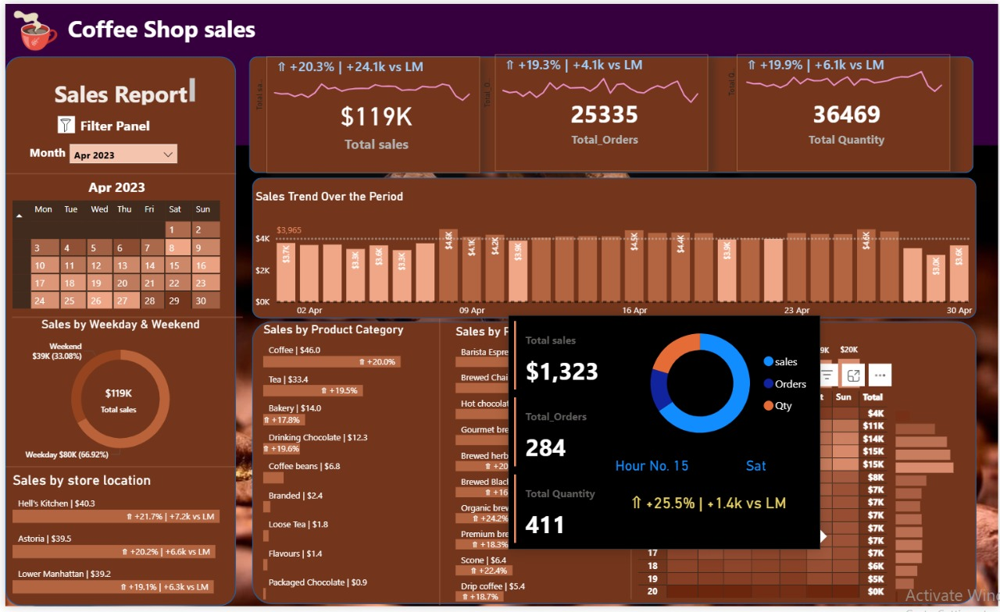
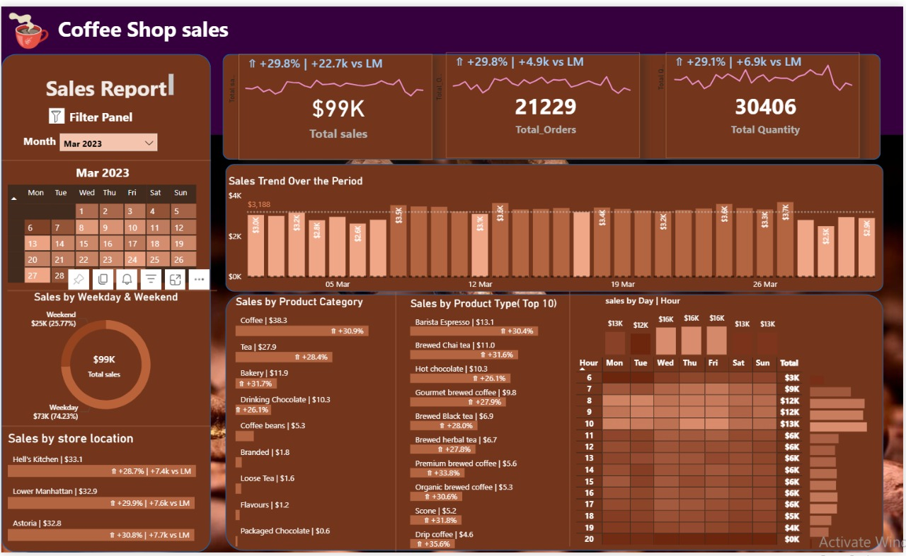
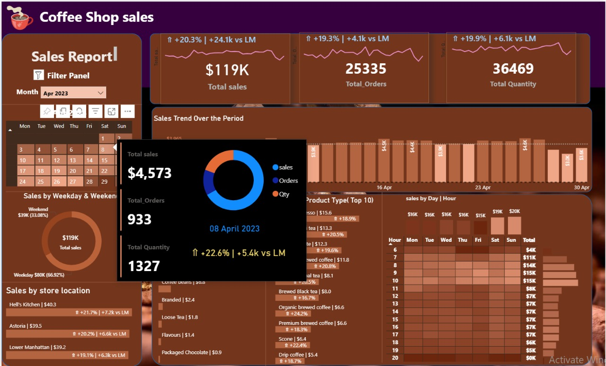

# ☕ Coffee Shop Sales Analysis

This project showcases a complete sales analysis for a fictional coffee shop using **Power BI** and **SQL**, focused on deriving KPIs, identifying trends, and providing actionable business insights.

---

## 📌 Project Objective

To build a dynamic and insightful dashboard that tracks:
- Total sales, orders, and quantity sold
- Monthly growth comparisons (MoM % changes)
- Best-performing products, categories, store locations
- Sales by day of the week, hour, and calendar date

---

## 📊 Tools & Technologies Used

- **Power BI** – Interactive dashboarding and visuals
- **SQL (MySQL)** – Data transformation, KPI extraction
- **Excel** – Source data

---

## 📈 Dashboard Preview

More preview images:
- 
- 

---

## 🧮 Key KPIs & Measures

- Total Sales, Total Orders, Total Quantity
- MoM Growth Metrics (% Change)
- Sales by:
  - Store Location
  - Product Category & Type
  - Weekday vs Weekend
  - Time of Day (Hourly Trends)

---

## 🛠️ SQL Logic Used (Summary)

**Data Cleaning:**
--- sql
Convert date and time to correct format
UPDATE coffee_shop_sales
SET transaction_date = STR_TO_DATE(transaction_date, '%d-%m-%Y');

ALTER TABLE coffee_shop_sales
MODIFY COLUMN transaction_date DATE; ---

KPI Calculations:
-- Total Sales
SELECT ROUND(SUM(unit_price * transaction_qty)) AS Total_Sales
FROM coffee_shop_sales
WHERE MONTH(transaction_date) = 5;

-- MoM Growth
SELECT 
    MONTH(transaction_date) AS month,
    ROUND(SUM(unit_price * transaction_qty)) AS total_sales,
    (SUM(unit_price * transaction_qty) - LAG(SUM(unit_price * transaction_qty), 1)
    OVER (ORDER BY MONTH(transaction_date))) / LAG(SUM(unit_price * transaction_qty), 1)
    OVER (ORDER BY MONTH(transaction_date)) * 100 AS mom_increase_percentage
FROM coffee_shop_sales
WHERE MONTH(transaction_date) IN (4, 5)
GROUP BY MONTH(transaction_date)
ORDER BY MONTH(transaction_date);
(Full SQL logic for all KPIs like Orders, Quantity, Categories, Products, Trends included in MY SQL Queries docx.)

## 📊 Power BI Dashboard Features:

Calendar filter by month

Dynamic KPIs with MoM comparisons

Sales by Weekday/Weekend visual

Bar charts for product/category/store breakdowns

Line charts and donut visuals for trends

## ✅ ✅ ✅ ✅ Business Insights ✅ ✅ ✅ ✅

Highest sales during weekends and evening hours

Coffee products dominate sales share

Consistent growth observed MoM for April

Store locations like Hell's Kitchen and Astoria show highest conversions

⭐ Don’t forget to ⭐ star the repo if you liked it!
